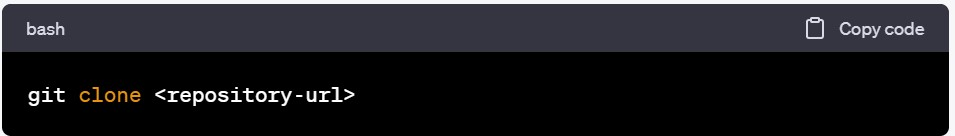

## PayScan

Demo

## PayScan - Barcode Scanning Payment System

Payleaf is a modern payment system that allows users to pay for goods and services using their smartphone cameras to scan barcodes. With Payleaf, users can make payments quickly and easily, without the need for cash or physical cards.

## Technology

This demo uses:

- ReactJs
- Tailwind CSS

## To clone this project, follow these steps:

-Go to the GitHub repository page of this project.

-Click the green "Code" button on the right side of the page.

-In the dropdown menu, select "HTTPS" or "SSH" depending on your preference.

-Copy the URL provided.

-Open your terminal or command prompt and navigate to the directory where you want to clone the project.

-Run the following command  replacing <repository-url> with the URL you copied in step 4:

-This will create a copy of the repository in your local directory.
